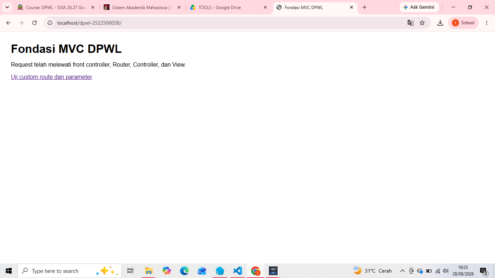
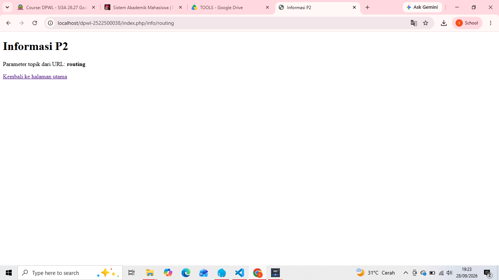

## 1. Tujuan Praktikum
untuk memhami konsep MVC dengan membangun framework MVC buatan sendiri, dari praktikum ini juga bertujuan untuk memahami alur kerja front controller, routing dan pemetaan url menggunakan helper.

## 2. Struktur Direktori
BASE: C:\laragon\www\DPWL-2522500038
DPWL-2522500038
 ┣ application
 ┃ ┣ config
 ┃ ┃ ┣ config.php
 ┃ ┃ ┗ routes.php
 ┃ ┣ controllers
 ┃ ┃ ┗ Home.php
 ┃ ┣ helpers
 ┃ ┃ ┗ url_helper.php
 ┃ ┗ views
 ┃ ┃ ┗ home
 ┃ ┃ ┃ ┣ index.php
 ┃ ┃ ┃ ┗ info.php
 ┣ assets
 ┃ ┗ css
 ┃ ┃ ┗ app.css
 ┣ system
 ┃ ┗ core
 ┃ ┃ ┣ controller.php
 ┃ ┃ ┗ router.php
 ┗ index.php

Fungsi setiap bagian:
1. index.php =  sebagai front controller utama
2. application/ = berisi kode utama yang dikembangkan developer
3. config/ = menyimpan file konfigurasi dan melakukan konfigurasi antar file
4. controllers = berisi class controller yang berfungsi yang mengatur logika aplikasi dan menyambungkan url ke tampilan
5. helpers = berisi fungsi pembantu seperti url_helper yang menyediakan fungsi base_url dan site_url
6. views = berisi file tampilan antar muka HTML/PHP
7. assets = menyimpan aset statis aplikasi seperti file css
8. system/core = berisi komponen inti buatan sendiri yaitu controller.php dan router.php

## 3. Front controller
file index.php berfungsi sebagai front controller yang dimana menjadi satu-satunya pintu masuk untuk semua request aplikasi.

## 4. Routing dan Pemetaan URL
| URL/Route | Controller | Method | Parameter | View |
| --- | --- | --- | --- | --- |
| / | Home | index | - | home/index.php |
| home/index | Home | index | - | home/index.php |
| home/info/mvc | Home | info | mvc | home/info.php |
| info/routing | Home | info | routing | home/info.php |
| home/info/atm | Home | info | atm | home/info.php |

1. URL/Route (home/info/atm): Request masuk melalui index.php (Front Controller), kemudian dibaca oleh system/core/router.php untuk mencocokkan URI path.
2. Controller (Home): Router mengidentifikasi segmen pertama URI (home) dan memanggil file class controller application/controllers/Home.php.
3. Method (info): Router menentukan segmen kedua URI (info) untuk memanggil method info() di dalam class Home.
4. Parameter (atm): Segmen ketiga URI (atm) dikirimkan oleh Router sebagai argumen parameter variabel $topik ke dalam method info($topik).
5. View (home/info.php): Method Home::info() membungkus data parameter tersebut ke dalam array $data lalu memanggil file tampilan application/views/home/info.php untuk dirender dan dikirim kembali sebagai HTML response ke browser.

## 5. Base URL dan Helper 
Fungsi Helper pada application/helpers/url_helper.php digunakan untuk mengelola pembentukan URL secara terpusat dan dinamis. Hal ini dilakukan agar alamat internal aplikasi tidak ditulis secara kaku (*hard-coded*).

Penjelasan fungsi dan contoh penerapannya pada implementasi P2:

1. base_url(): 
   Fungsi ini digunakan untuk membentuk alamat URL dasar proyek, terutama saat memanggil berkas aset statis seperti CSS, JavaScript, atau gambar.
   -Contoh Implementasi: Digunakan pada file views/home/index.php untuk memanggil berkas CSS aplikasi.

2. site_url(): 
   Fungsi ini digunakan untuk membentuk URL navigasi internal atau rute halaman di dalam aplikasi dengan menyertakan berkas index.php.
   -Contoh Implementasi: Digunakan pada file views/home/index.php untuk membuat tautan navigasi menuju halaman rute lain.

# 6. Alur request-response
   - Browser: Pengguna mengirimkan permintaan (*request*) dengan mengakses URL aplikasi.
   - index.php: Berfungsi sebagai *Front Controller*, memuat konfigurasi utama, *helper*, dan inisialisasi *router*.
   - Router: Memproses URI dari URL untuk menentukan *Controller*, *Method*, dan *Parameter* yang dituju.
   - Controller: Kelas *Controller* (Home.php) dijalankan, memproses logika aplikasi, dan memanggil *View*.
   - View: Menampilkan antarmuka HTML kepada pengguna.
   - Response: Hasil tampilan akhir dikirimkan kembali ke *browser* pengguna.

# 7. Skenario Pengujian Valid dan Tidak Valid
| No. | URL / Request | Ekspektasi Hasil | Status Uji |
| --- | --- | --- | --- |
| 1 | http://localhost/DPWL-2522500038/ | Menampilkan halaman utama melalui default controller (Home::index). | Valid / Berhasil |
| 2 | .../index.php/home/index | Pemetaan langsung ke controller Home dan method index berhasil. | Valid / Berhasil |
| 3 | .../index.php/home/info/mvc | Menampilkan halaman info dengan parameter mvc. | Valid / Berhasil |
| 4 | .../index.php/info/routing | Custom route pada routes.php bekerja dan menampilkan parameter routing. | Valid / Berhasil |
| 5 | .../index.php/home/info/atm | Custom route modifikasi ATM berjalan dan menampilkan parameter atm. | Valid / Berhasil |
| 6 | .../index.php/tidakada | Menampilkan pesan error 404: "Controller tidak ditemukan." | Tidak Valid (Sesuai Ekspektasi 404) |
| 7 | .../index.php/home/tidakada | Menampilkan pesan error 404: "Method tidak ditemukan." | Tidak Valid (Sesuai Ekspektasi 404) |
Pemeriksaan Sintaks dan Dokumentasi Debugging
Seluruh berkas PHP pada aplikasi telah diperiksa melalui terminal VS Code menggunakan perintah php -l dengan hasil "No syntax errors detected" (tidak ditemukan kesalahan sintaks PHP).

Dokumentasi Proses Debugging:
Gejala: Saat mengakses rute info/routing, layar browser menampilkan pesan "View tidak ditemukan." (HTTP 500).
Penyebab: Terdapat kekeliruan penulisan nama berkas tampilan pada perintah $this->view(home/info, $data) di controller Home.php, di mana berkas yang ada di folder views/home/ sempat bernama informasi.php
Perbaikan: Mengubah nama berkas application/views/home/informasi.php menjadi application/views/home/info.php agar sesuai dengan pemanggilan pada controller.
Hasil Uji Ulang: Rute info/routing berhasil diakses kembali dan menampilkan halaman tampilan secara sempurna.

## 8. Dokumentasi 

## 9. Kesimpulan
kerangka kerja MVC buatan sendiri telah berhasil dibangun dan dapat berfungsi untuk:
1. Menerima seluruh permintaan pengguna secara terpusat melalui Front Controller index.php
2. Mengurai URL dan memetakan rute Routing ke Controller, Method, dan Parameter yang sesuai.
3. Menyajikan tampilan HTML View secara dinamis dengan bantuan fungsi Helper base_url() dan site_url().

Rencana Pengembangan pada P3:
Kerangka kerja ini belum memiliki komponen Model untuk pengelolaan data. Pada Pertemuan 3 (P3), kerangka akan dilengkapi dengan modul Model, koneksi basis data menggunakan MySQLi/prepared statement, mekanisme autentikasi, manajemen sesi, serta integrasi antarmuka AdminLTE.
